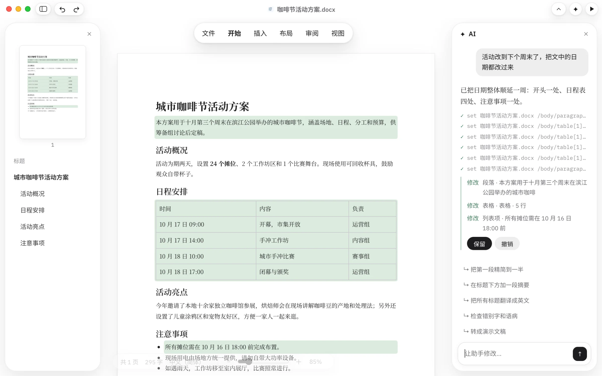
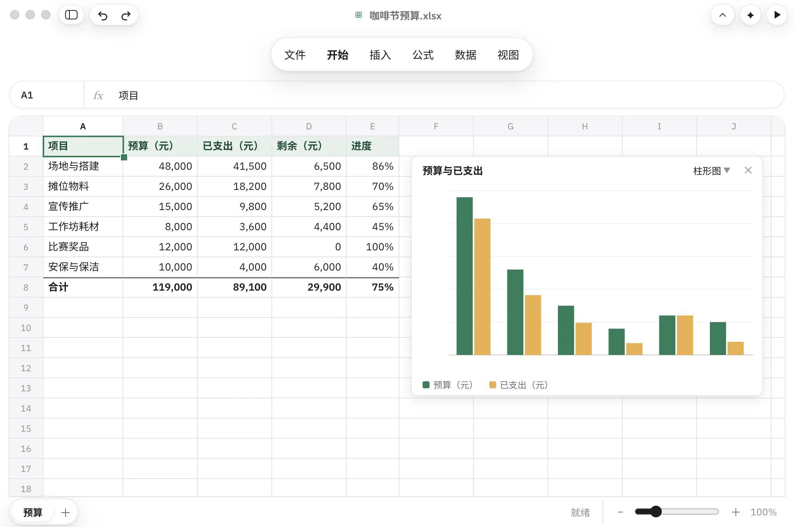
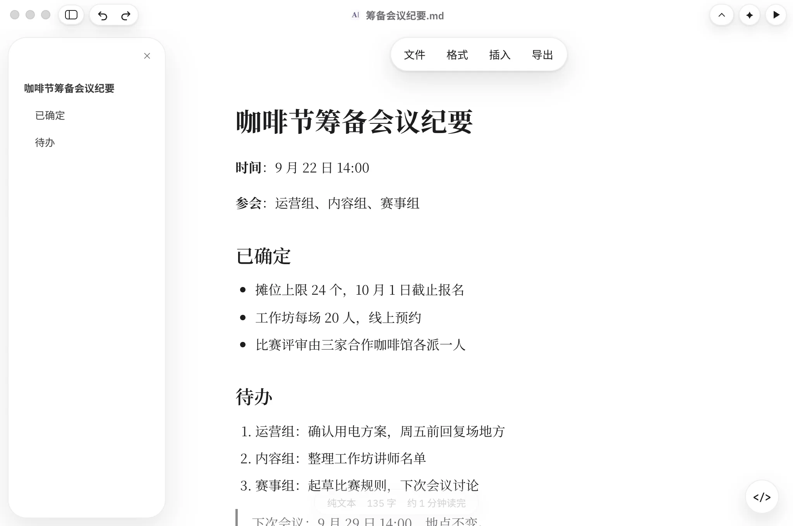

<p align="center">
  <!-- 浅色页面配深色图标、深色页面配浅色图标，和 Windows 版「关于」一样取对比 -->
  <picture>
    <source media="(prefers-color-scheme: dark)" srcset="ui/assets/writer-logo-light.svg">
    
  </picture>
</p>

<h1 align="center">Writer</h1>

<p align="center">
  <b>Word、Excel、PPT，在 Mac 上直接改。</b><br>
  改动一秒内存回原文件，没动过的内容原样保留。内置 AI 助手，用你自己的模型。
</p>

<p align="center">
  <a href="https://github.com/Auspexlabs/writer/releases/latest">下载 Mac 版</a> ·
  <a href="docs/engine.md">引擎文档</a> ·
  <a href="README.en.md">English</a>
</p>

<p align="center">
  
</p>

## Writer 是什么

这个仓库里有两样东西，用的是同一套代码：

- **Writer 应用**：Mac 上的文档应用。Word、Excel、PowerPoint、Markdown 和思维导图打开就能改，改动直接存回原文件；PDF 可以查看。内置 AI 助手，接入你自己的模型。
- **Writer 引擎**：一个名为 `writer` 的可执行文件，读、写、改 .docx、.xlsx、.pptx、.md 和 .mm 文件，读取 PDF，在格式之间转换。文档是一棵树，每个元素都有路径，每条命令都输出 JSON。它同时是命令行工具、MCP 服务和本地 HTTP 接口。应用里的编辑器和 AI 助手用的都是它。

## 功能

- **六种文档，一个应用。** Word（.docx）、Excel（.xlsx）、PowerPoint（.pptx）、Markdown（.md）和思维导图（FreeMind 格式 .mm）都能直接编辑。PDF 可以查看，也能转成 Word 接着改。
- **文件还是那个文件。** 不导入，不转换。在 Finder 里双击的那一份，就是正在编辑的这一份。每次修改在一秒内写回原文件；批注、图表、动画和样式，没动过的部分原样保留。
- **AI 助手，用你自己的模型。** 说一句要改什么，助手直接在文档里动手。改了哪些地方列在回复下面，满意就保留，不满意一键撤销。可以接入 Anthropic、OpenAI、DeepSeek、通义千问、Kimi、智谱、豆包，任何兼容 OpenAI 接口的服务，以及 Ollama、LM Studio 这样的本机模型。API Key 只保存在你的电脑上。
- **图片工具。** 抠图（用 macOS 自带的 Apple Vision，在本机完成）、裁剪、旋转和压缩图片。
- **照 Mac 的习惯来做。** 原生菜单和快捷键，浅色与深色，双指缩放，幻灯片放映。新建的文档先存成草稿，第一次存储时再选位置。

<table>
  <tr>
    <td width="50%"><br>表格：公式、图表和多个工作表</td>
    <td width="50%"><br>演示：编辑幻灯片，设置切换效果，直接放映</td>
  </tr>
  <tr>
    <td width="50%"><br>思维导图：可以转成大纲、Word 或演示文稿</td>
    <td width="50%"><br>Markdown：排版视图和源代码随时切换</td>
  </tr>
</table>

## 下载

用 Homebrew 安装：

```bash
brew install --cask auspexlabs/tap/writer
```

也可以在 [GitHub Releases](https://github.com/Auspexlabs/writer/releases/latest) 下载 dmg。安装包已签名并通过 Apple 公证，打开后把 Writer 拖进「应用程序」文件夹即可。

- 系统要求：macOS 14 或更高版本，目前适用于 Apple 芯片的 Mac。
- Windows 版正在开发中。
- 官方发布的 Writer 应用对所有人免费，企业和组织在工作中使用也一样。

## 给开发者

应用里的文档引擎就是 `writer` 命令。装好应用以后可以直接在终端里用：

```bash
W=/Applications/Writer.app/Contents/MacOS/writer   # 用 Homebrew 安装的，直接用 writer

$W view 方案.docx outline          # 列出每个元素和它的路径
$W set 方案.docx '/body/table[1]/row[2]/cell[1]' --prop text="10 月 17 日 09:00"
$W export 方案.docx --to 方案.md   # 转成其他格式

# 注册为 MCP 服务：在你的 AI 工具里添加这条命令
$W mcp
```

MCP 服务只有一个工具 `writer`，参数就是上面这样的一行命令（不带程序名），返回的内容和命令行输出一致。`writer serve` 提供本地 HTTP 接口，`writer app` 在浏览器里打开编辑器。

- 全部命令、路径语法、HTTP 接口和 MCP 配置：[docs/engine.md](docs/engine.md)
- 给 AI 智能体的使用说明：[SKILL.md](SKILL.md)

## 从源代码构建

引擎需要 .NET 10 SDK，编辑器的测试需要 Node 20。

```bash
dotnet test Writer.slnx        # 引擎测试
node --test ui/tests/          # 编辑器逻辑测试
./build.sh osx-arm64           # 单文件 writer，输出到 dist/osx-arm64/（不带参数：macOS、Linux、Windows 全部构建）
dist/osx-arm64/writer app --dir ~/Documents   # 在浏览器里用编辑器打开一个文件夹
```

Mac 应用基于 Tauri 2，另外需要 Rust 工具链和 Xcode 命令行工具：

```bash
cd desktop
npm ci
npm run dev                    # 构建内置引擎，打开开发窗口
```

打包、签名和诊断见 [desktop/README.md](desktop/README.md)。

## 目录结构

```
src/          引擎（.NET 10）：Writer.Core 文档树与路径，Writer.Formats 各格式的读写，
              Writer.Cli 命令行、MCP 服务、HTTP 服务和 AI 助手
ui/           编辑器：每种格式一个页面，engine.js 负责和引擎通信
desktop/      Mac 应用（Tauri 2 窗口加内置引擎），Windows 版在开发中
website/      官网，纯静态页面
tests/        引擎测试：单元、格式适配器、命令行和往返保真
docs/         引擎参考、设计文档和计划、README 用的截图
brand/        标志和文件图标
SKILL.md      给 AI 智能体的使用说明
```

## 参与贡献

欢迎在 GitHub Issues 里报告问题、提出建议。Writer 采用双重许可，所以提交代码需要先同意贡献者许可协议（CLA）；正式的 CLA 流程上线之前，暂不合并外部的 Pull Request。构建、测试和提交信息的约定见 [CONTRIBUTING.md](CONTRIBUTING.md)。

## 许可

- **源代码**：以 [AGPL-3.0](LICENSE)（仅第 3 版）开源，并附有 AGPL 第 7 条允许的附加条款，见 [NOTICE](NOTICE)：分发 Writer 或它的修改版，或者通过网络提供修改版时，要在「关于」界面和文档里保留 “Writer by Auspex” 署名和版权声明；修改版要标明经过修改，不能以官方 Writer 应用的名义发布。
- **商业许可**：想在自己的产品或服务里使用 Writer 的源代码，又不想承担 AGPL 的义务，可以向 Auspex 申请商业许可，见 [COMMERCIAL.md](COMMERCIAL.md)。
- **官方应用免费**：Auspex 发布的 Writer 应用对所有人免费，包括企业和组织在工作中使用。商业许可只针对源代码的再利用。
- **商标**：Writer 的名称和标志、Auspex 的名称不在 AGPL 的授权范围内。
- **第三方组件**：按各自的许可证使用，见 [THIRD_PARTY_NOTICES.md](THIRD_PARTY_NOTICES.md)。

以上是简要说明，具体以 LICENSE 和 NOTICE 的原文为准。

## 联系

- 商业许可、技术支持和反馈：[mosheng9@outlook.com](mailto:mosheng9@outlook.com)

---

Writer by Auspex<br>
Copyright (C) 2026 北京奥斯佩克斯网络科技中心 (Auspex)
